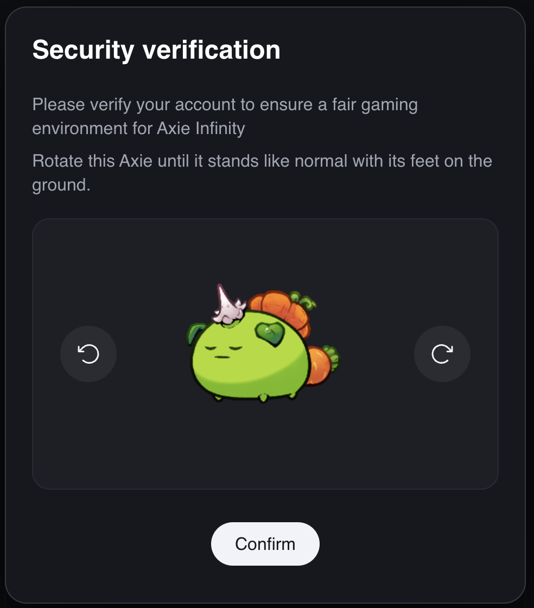

# Skymavis Captcha Solver

This API solves captchas for sites using Skymavis OAuth. It provides a solution for bypassing the captcha challenge programmatically.



## Setup

1. Install the required dependencies:

```
pip install -r requirements.txt
```

2. Configure the `APP_KEY` in `solve_captcha.py`:
   - Open `solve_captcha.py`
   - Locate the `APP_KEY` variable
   - Replace the value with the app key of the site you're targeting (e.g., Wildforest)

3. Set up a proxy:
   - In `solve_captcha.py`, find the `proxies` dictionary
   - Replace `"--your-proxy-url--"` with your actual proxy URL for both HTTP and HTTPS

## Usage

1. Start the Flask server:

```
python app.py
```

2. The API will be available at `http://localhost:5000`

3. To solve a captcha, send a POST request to the `/solve_captcha` endpoint

## API Endpoint

- **URL**: `/solve_captcha`
- **Method**: POST
- **Response**: 
  ```json
  {
    "result": {
      "id": "captcha_id",
      "success": "right"
    },
    "token": "captcha_token",
    "clicks": 0-330 -> rotation degree
  }
  ```

## Note

This tool is for educational purposes only. Make sure you have permission to use it on the target website.

## Troubleshooting

If you encounter any issues, check the console output for error messages. Ensure that your APP_KEY and proxy settings are correct.
